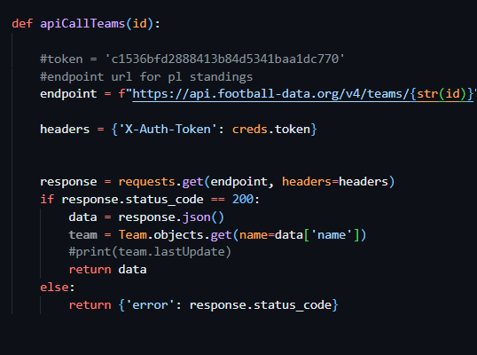
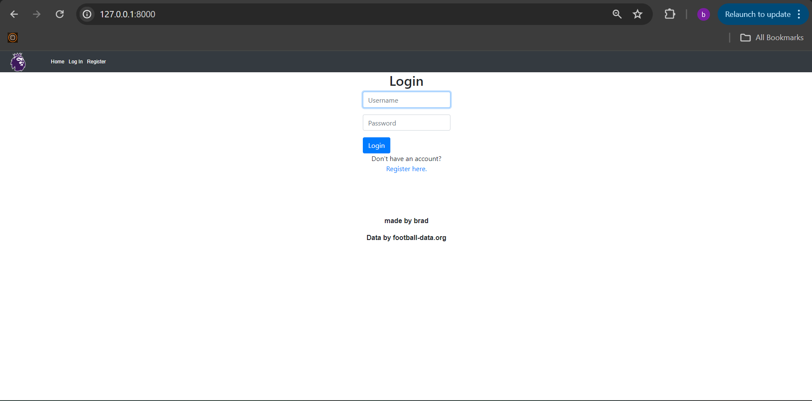
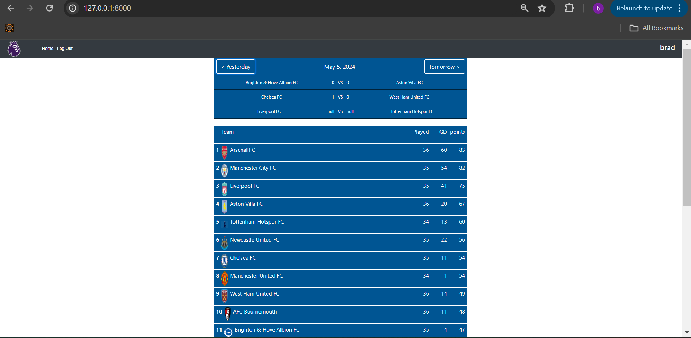

# premierleague50

## Introduction

This website is for information and data about the English premier league. Using APIs from football-data.org and sqlite databases, users can find fixtures, results, league standings and team information.

## Distinctiveness and Complexity

This website is different and more complex than any other project in this course. 

Firstly, i have used a third party API that i have not done before. I spent a long time trying to find the best API for me. Eventually i settled on [football-data.org](https://www.football-data.org/). It being free to use with a limit of 10 request a minute worked for me. As each page required a few api request at a time, i took the decision to store data in databases that i could use as much as i want. 

As this website is for live updates i needed to manage my API request per minute and the speed my site loads with all the data being processed. As mentioned before i stored all my data in databases. To get around the problem of having live updates, i set my backend up so it automatically updates my database every day.

This website gives information on games by day. Whenever the home page has been loaded, the fixture view will automatically be the current day. Using javascript, databases and fetch, the user can toggle between days to see past result and future fixtures

## Index page

I have made my site to be used by login in. I made this decision because i want to develop this app further in the future to be more like a social media site.

If the user in not signed in, the index page is the login view. There is links to sign up if the user has not already.

When logged in todays fixtures/results will show under the nav bar. Here the user can toggle through the days with buttons. Using javascript the games will be updated and shown without reloading the page.

Under the games the current premier league table is loaded. I have included the teams name and crest, Games played, goal difference (GD) and Points.
Each team name is a link to the a team view page that shows information specific to that team.

## Teams 

When on the Teams view the user will have access to lots of information about that team. This includes, manager, stadium, all the players and their position.

## Setup
    git clone https://github.com/me50/bradlloy95/blob/web50/projects/2020/x/capstone
    cd premierleague50
    pip install -r requirements.txt

Once this is done you can run your migrations

    python manage.py makemigrations
    python manage.py migrate

finally you can run the server

    python manage.py runserver